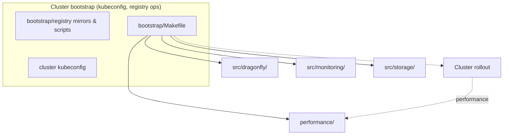
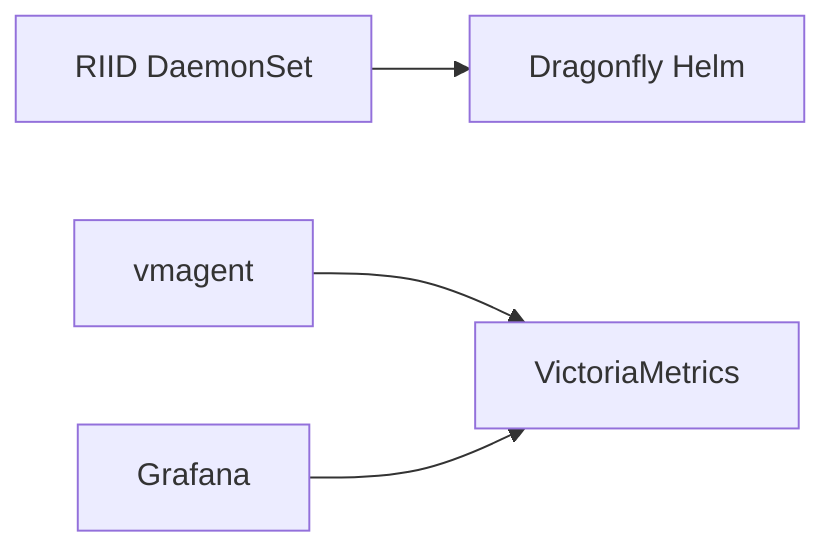

## deploy/k8s

## Quickstart
## Install cluster
make -C deploy/k8s/bootstrap install-all
## Install local registry
make -C deploy/k8s/bootstrap/registry registry-apply-profile
make -C deploy/k8s/bootstrap/registry install-local-registry
make -C deploy/k8s/bootstrap/registry wait-local-registry
make -C deploy/k8s/bootstrap/registry load-performance-registry-dataset
## Testing
make -C deploy/k8s/performance clear-cache-dfinit
make -C deploy/k8s/performance riid-podman DATASET=A SCENARIO=prep
make -C deploy/k8s/performance bare-podman DATASET=A SCENARIO=prep
make -C deploy/k8s/performance metrics

Полный список используемых команд(созадние кластера, тестирование, дебаг) в _commands.md

## Container engines live on the node

Every engine in the bench matrix has one shape: **a daemon on the node, reached over a socket.**
containerd (`/run/containerd/containerd.sock`) and Porto (`/run/portod.socket`) were already like
that; podman is daemonless by design, so the node runs the packaged `podman.socket`. RIID's Java
adapter sends Libpod HTTP directly to `CONTAINER_HOST=unix:///run/podman/podman.sock`; the RIID
image deliberately contains no Podman CLI or containers stack.

```
make -C deploy/k8s/bootstrap install-podman-node   # DaemonSet: installs podman, enables the socket
make -C deploy/k8s/bootstrap wait-podman-node      # waits, then prints podman/OS/kernel per node
```

`install-podman-node` must run **before** `install-riid` (`install-all` already orders it that way):
the RIID DaemonSet mounts the socket with `type: Socket`, so without it the pods never start.

Why it matters for the numbers: previously podman ran inside the RIID pod with
`mount_program = fuse-overlayfs` and no hostPath under `graphroot`, so every import unpacked through
userspace FUSE into the container's own writable layer — overlay on overlay. `engine.import` is 76%
of a cold request (ADR-11), so that was measuring the test rig. It also applies to both arms at once:
the RIID import and the baseline pull now hit the same node store.

Two operational consequences:

- **Registry address.** A node-side engine resolves names in the host netns, where there is no
  cluster resolver. `riid_registry_node_host` (`performance/backend/engine/common.inc.sh`) turns a
  `*.svc.cluster.local` name into the Service ClusterIP, which *is* routable there because kube-proxy
  programs its rules in that namespace. RIID's own download is unaffected — it runs in the pod.
- **Baseline vs dfinit.** dfinit edits the node's `/etc/containers/registries.conf`, the very file the
  daemon reads, so the baseline can no longer be pointed at a private copy through a client-side
  `CONTAINERS_REGISTRIES_CONF`. Instead each arm asserts what it needs: `engine_mirror_check` (mirror
  present) for dfinit, `engine_no_mirror_check` (mirror absent) for the baseline, both read from
  `podman info` — the daemon's own resolved view, not a file. A pristine copy is kept at
  `/etc/containers/registries.conf.riid-baseline` when podman is first installed.

## Cluster environment

- 12 nodes;
- 4 vCPU, 2.2-2.4 GHz;
- 8 GB RAM;
- SSD: 140 GB, 500 MB/s, 25,000 / 15,000 IOPS;
- SSD was not a bottleneck;
- Average cluster network speed: 160-200 MB/s.

### Network / `tc` (Traffic Control)

**No WAN emulation in Recreate scenario:** RTT or bandwidth limits via Linux **Traffic Control (`tc`, `netem`, TBF, etc.) are NOT applied** by performance/bootstrap scripts. Measurements are conducted in the **real cluster topology** (provider nodes ↔ registry, Dragonfly, SLA network/disk limits).

This deliberately differs from some research papers (e.g., NSDI 2022 *Starlight*) that use fixed **RTT/BW via `tc`** between VMs. Traffic limiting was used exclusively to find the boundary of Dragonfly's effectiveness. Without limits, RIID with P2P showed 200% speed compared to Podman on ~10 images in the rolling scenario. 

## Performance results

### Rolling scenario (CONCURRENCY=2, sequential with limits)

10 RIID pods pulling 91 images with concurrency limit of 2 pods at a time.

| Metric | RIID+Dragonfly | Podman (baseline) | Result |
|--------|---------------|-------------------|---------|
| Registry TX (egress) | **19.7 GiB** | 112.6 GiB | **−82.6%** traffic reduction |
| Download speed | **~1.09×** slower | 1.00× | Comparable with P2P overhead |

**[Interactive scatter: rolling scenario](../../docs/images/riid-p2p-vs-podman-scatter.html)**

### Recreate scenario (all pods simultaneously)

All 10 RIID pods pulling 91 images simultaneously (Kubernetes `Recreate` deployment strategy).

| Metric | Formula | RIID+Dragonfly | Podman (baseline) | Ratio |
|--------|---------|---------------|-------------------|-------|
| **Sum of means** | Σt̄ᵣ / Σt̄ₚ | 875 sec | 1073 sec | **0.82×** (18% faster) |
| **Sum of aggregates** (wall-clock) | ΣTᵃᵍᵍ / ΣTᵃᵍᵍ | 969 sec | 1108 sec | **0.88×** (12% faster) |
| **Registry TX** (egress) | — | **11.6 GiB** | 112.6 GiB | **−89.7%** |

**[Interactive scatter: recreate scenario](../../docs/images/riid-p2p-vs-podman-scatter-recreate.html)**

Где:
- **Sum of means**: сумма средних времён загрузки по 10 pod на каждый образ
- **Sum of aggregates**: сумма максимумов (wall-clock времени кластера на каждый образ)
- Recreate сценарий демонстрирует лучшую эффективность P2P при одновременной нагрузке

Датасет обоих сценариев (91 образ): `config/imagelist/dataset_a_91_sizes.tsv`.

### Top-20 dataset (containerd, podman, Porto)

Второй, меньший датасет: 20 самых скачиваемых образов Docker Hub по `pull_count × size_bytes`,
с размерами, дайджестами и временем снятия — `config/imagelist/dataset_top20_sizes.tsv`.
Каждый сценарий: 10 подов × 20 образов, все поды стартуют одновременно (`recreate`), RIID v0.4.14.

Две метрики, каждая считается для сценария как сумма по 20 образам:
1. **Весь кластер** — время, за которое образ скачался на все ноды кластера (строка `AGGREGATE`:
   от старта первого пода до финиша последнего). Основная: кластер готов, когда готова последняя нода.
2. **Среднее на ноду** — среднее по нодам время, за которое образ скачался на одну ноду.

| Engine | Source | Метрика 1: весь кластер | Метрика 2: среднее на ноду | Registry TX | Run |
|--------|--------|-----------:|-----------------:|------------:|-----|
| containerd | registry, direct | 836.0 с | 812.7 с | 117.41 ГиБ | `bare-containerd.agent130-20260913-0016` |
| containerd | Dragonfly via dfinit | **397.3 с** | 346.2 с | **11.84 ГиБ** | `dfinit-containerd.agent130-20260913-0108` |
| containerd | RIID + Dragonfly, prefix | 619.8 с | 540.1 с | **11.82 ГиБ** | `riid-containerd.agent130-20260913-0201` |
| containerd | RIID + Dragonfly, archive | 631.8 с | 555.6 с | **11.82 ГиБ** | `riid-containerd-noprefix.agent130-20260913-0128` |
| podman | registry, direct | 764.2 с | 753.4 с | 117.42 ГиБ | `bare-podman.agent119120-20260913-1329` |
| podman | Dragonfly via dfinit | **366.7 с** | 342.7 с | **11.82 ГиБ** | `dfinit-podman.agent119120-20260913-1407` |
| podman | RIID + Dragonfly | 685.1 с | 644.2 с | **11.82 ГиБ** | `riid-podman.agent119120-20260913-1344` |

Каждая строка движка снята одной серией на одном стенде (containerd — 13.09 ночью, podman —
13.09 днём), все семь сценариев прошли `validate-arm.sh`. Сравнивать сценарии можно **внутри
движка**; между движками стенды разные, а один и тот же сценарий между стендами расходится до 46%.

Как читать:
- **Трафик.** RIID и dfinit неразличимы: оба отдают реестру одну копию датасета вместо десяти
  (−89.9% на обоих движках). Egress `dfinit-podman` совпал до 0.2% на трёх разных стендах.
- **Время.** dfinit быстрее RIID на обоих движках: он отдаёт слои прямо движку, а RIID сначала
  собирает образ и потом импортирует его. На podman разрыв больше (−10.3% против −52.0% к bare,
  на containerd −25.9% против −52.5%): Libpod `images/load` сначала пишет присланный архив
  во временный файл и только потом импортирует, а `ctr images import` читает поток напрямую.
- **Prefix против archive на containerd** — 619.8 против 631.8 с (−1.9%). Это меньше разброса
  самого стенда: `bare-containerd` на нём снят дважды, 878.0 и 836.0 с (4.8%). Считать префикс
  быстрее по одной точке нельзя.

#### Porto (AGENT-132)

Porto не запускается на MKS, поэтому снят на отдельном стенде `terraform-porto`: kubeadm на
Ubuntu 22.04, cgroup v1, Porto 5.3.58, те же flavor и диски, 10 воркеров + 4 инфраноды. Все три
сценария прошли `validate-arm.sh`. Сценария dfinit у Porto нет.

| Engine | Source | Метрика 1: весь кластер | Метрика 2: среднее на ноду | Registry TX | Run |
|--------|--------|-----------:|-----------------:|------------:|-----|
| Porto | registry, direct (TLS-вход) | 871.3 с | 860.8 с | 120.10 ГиБ | `bare-porto.agent132-20260913-1627` |
| Porto | RIID + Dragonfly, послойный импорт | **430.6 с** (−50.6%) | **389.1 с** (−54.8%) | **12.06 ГиБ** (−90.0%) | `riid-porto.agent132-20260913-1718` |
| containerd (якорь) | registry, direct | 921.8 с | 882.3 с | 120.14 ГиБ | `bare-containerd.agent132-20260913-1700` |

- Porto-сценарии сравнимы только между собой. С MKS стенд связывает якорь `bare-containerd`:
  921.8 с здесь против 836.0 с на MKS, то есть стенд примерно на 10% медленнее (по метрике 2 +8.6%).
  Около 12.8 с этой разницы — четыре холодных повтора `fluent-bit` после обрыва exec-стрима к API.
- Porto 5.3.58 качает блобы только по https, поэтому `bare-porto` шёл через TLS-вход к тому же
  хранилищу реестра; RIID ходит по http.
- `riid-porto`: все 2200 слоёв из P2P, `layer.import` 2190, без отката на rootfs. Образ,
  импортированный RIID, запускается контейнером Porto (python:latest, HTTP 200).
- Скорость `riid-porto` проверена по логам, это не кэш и не пропуск импорта. Перед прогоном на
  нодах 0 слоёв Porto, scratch RIID и хранилища Dragonfly (включая seed) пусты. Выполнено 2000
  `portoctl layer -I` (200 уникальных слоёв × 10 нод), ни одного «слой уже есть». Размеры слоёв
  побайтно совпадают с `riid-containerd`. Скачивание такое же, как у `riid-containerd`: 1932 с
  против 1938 с суммарно по всем запросам. Разница в импорте: после скачивания 191 с на Porto против 331 с
  на containerd (сумма медиан по образам). Импорт — около половины запроса RIID и на Porto.

Сырые прогоны и формат файлов — [`performance/results/`](performance/results/).

## Change test registry_provider:
Change config.yaml
Generate test dataset.
make -C deploy/k8s/providers generate-registry-image-lists

Kubernetes manifests for **RIID** + **Dragonfly** (same Helm values as CI: root `scripts/values.yaml`). One Dragonfly client only—in `dragonfly-system`; do not add dfdaemon in `riid-system`. Java-side notes: **internalDocs/moduledocs/**.

Image truth lives in **`config/imagelist/dockerhub.yaml`**; **`mapper-common.sh`** + **`imagelist_emit_overlays.py`** produce **`selectel.yaml`** / **`local.yaml`**. On the workstation, **`deploy/k8s/providers/`** runs overlays, datasets, and **`provider-apply`**, which copies `src/` (+ optional `performance/`) into **`.resolved/`** and resolves logical `image:` keys from the catalog (`.resolved/` is gitignored).

## Scripts architecture


### Env
Under **`deploy/k8s/config/`** (see **`config/.env.example`**):
```env
RIID_DOCKERHUB_USER=
RIID_DOCKERHUB_TOKEN=
RIID_SELECTEL_USER=
RIID_SELECTEL_TOKEN=
```

### Layout

| Path | Role | Notes |
|------|------|------|
| `src/` | Cluster manifests and Helm charts (Dragonfly installer, optional default storage class, RIID workload, node engine daemons in `src/engines/`, vmagent worker, observer chart) | Logical `image:` keys; not applied directly until resolved |
| `config/` | Environment and catalogs | `config.yaml`, `imagelist/`, `.env` (registry credentials on the workstation) |
| `providers/` | Generation and resolution | Builds imagelist overlays, runs `provider-apply` into `.resolved/` |
| `bootstrap/` | Deploy entrypoint | Main `Makefile` drives kubectl/helm; `bootstrap/registry/` handles registry profiles, secrets, mirrors, perf helpers (`SELECTEL_DIR` in scripts is a legacy name for this directory) |
| `.resolved/` | Materialized tree | Gitignored copy of `src/` (and related paths) with concrete image references—what kubectl and Helm actually use |

### Flow



RIID and the Helm Dragonfly client run on workers; node `riid.monitoring=true` hosts VM/Grafana and is excluded from RIID/dfdaemon; vmagent is cluster-wide.

### Deployment

**Kubeconfig:** Bootstrap reads `deploy/k8s/providers/cluster/Selectel/serverConfig.yaml` by default (copy from `serverConfig.example.yaml` there if missing); override with `CONFIG_FILE` on each `make -C deploy/k8s/bootstrap …` invocation.

**Resolved manifests:** Sources under `src/` keep abstract image references. `provider-apply` writes a `.resolved/` tree with real digests/tags so kubectl and Helm stay reproducible. RIID, metrics, observer install paths run that resolution for you; if you apply YAML by hand, run the bootstrap target that refreshes Kubernetes manifests first. Helm values for the observer chart and Dragonfly (e.g. Selectel registry profile) come from the same resolved material—generate overlays on the workstation before rollout so registry-specific Helm snippets exist.

**Full rollout:** `make -C deploy/k8s/bootstrap install-all` walks the happy path for a Selectel/OpenStack cluster with the default storage class: ensure storage and node labels suit Dragonfly and the monitoring VM, install Dragonfly then RIID, wait until RIID is healthy and tooling checks pass, bring up VictoriaMetrics scraping and the Grafana observer stack, then wait until that observer is ready. Optional local registry mirroring and dataset loads are handled from `bootstrap/registry/` when you need them.

**Step-by-step:** You can run the same phases individually via `deploy/k8s/bootstrap/Makefile` (storage validation and node labeling, Dragonfly, RIID + waits/verification, metrics, observer chart sync/install/wait) instead of `install-all`.

**Registry lists on the workstation:** From `deploy/k8s/providers/`, regenerate imagelist overlays and registry image-list artifacts whenever the catalog changes; dataset inclusion follows `test_registry_provider` (and related keys) in `config.yaml`.

**Registry credentials:** Keep secrets in `deploy/k8s/config/.env` and push cluster pull secrets through the `bootstrap/registry/` Makefile targets for Docker Hub, Selectel, or local registry profiles.

**Smoke pull:** `make -C deploy/k8s/bootstrap smoke-download` performs an end-to-end pull using a Docker Hub–style repository path (`SMOKE_REPOSITORY`, default `library/jobber`). The repo RIID should use is derived from `config.yaml` plus the imagelist YAML via the smoke resolver scripts under `bootstrap/registry/` and `providers/registry/image/`. If the catalog omits an explicit registry host, set `TEST_REGISTRY_PULL_HOST` or `test_registry_pull_host` in `config.yaml`.

**Observer stack:** Delivered with Helm and synced Grafana assets via the monitoring-observer install path—not by applying stale standalone observer YAML.

**Other clusters:** Without Cinder’s default SC pass `STORAGE_CLASS=local-path`; the storage-default step then installs the local-path provisioner from `src/storage/` itself. Otherwise keep using the same bootstrap Makefile with your kube context.
