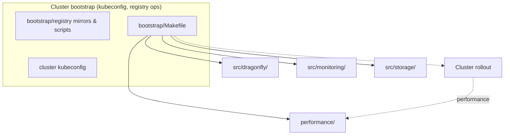
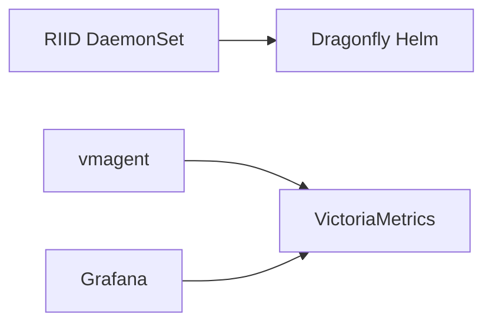

## deploy/k8s

## Quickstart
## Install cluster
make -C deploy/k8s/bootstrap install-all
## Install local registry
make -C deploy/k8s/bootstrap/registry registry-apply-profile
make -C deploy/k8s/bootstrap/registry install-local-registry
make -C deploy/k8s/bootstrap/registry wait-local-registry
make -C deploy/k8s/bootstrap/registry load-performance-registry-dataset
## Testing
make -C deploy/k8s/performance clear-cluster-cache
make -C deploy/k8s/performance run BACKEND=riid MODE=rolling CONCURRENCY=2 DATASET=A SCENARIO=perf-multi-riid
make -C deploy/k8s/performance summarize

Полный список используемых команд(созадние кластера, тестирование, дебаг) в _commands.md
## Окружение кластера

- 12 нод;
- 4 vCPU, 2.2-2.4 ГГц;
- 8 GB RAM;
- SSD: 140 ГБ, 500 МБ/с, 25 000 / 15 000 IOPS;
- SSD не являлся узким местом;
- средняя скорость сети в кластере: 160-200 МБ/с.

### Network / `tc` (Traffic Control)

**На этом дереве (`deploy/k8s`) WAN не эмулируется:** ограничения RTT или полосы через Linux **Traffic Control (`tc`, `netem`, TBF и т.п.) не применяются** скриптами performance/bootstrap. Замеры идут в **реальной топологии** кластера (узлы провайдера ↔ реестр, Dragonfly, лимиты SLA сети/диска).

Это сознательно отличается от ряда исследовательских статей (например, NSDI 2022 *Starlight*), где между VM гоняли фиксированные **RTT/BW через `tc`**. Если понадится воспроизводимый профиль WAN, его нужно вводить **отдельно** ( DaemonSet/helpers на нодах, NetworkPolicy+QOS где применимо, отдельный «шейпер» между стендами)—в этом репозитории универсального решения пока нет.
## Change test registry_provider:
Change config.yaml
Generate test dataset.
make -C deploy/k8s/providers generate-registry-image-lists

Kubernetes manifests for **RIID** + **Dragonfly** (same Helm values as CI: root `scripts/values.yaml`). One Dragonfly client only—in `dragonfly-system`; do not add dfdaemon in `riid-system`. Java-side notes: **internalDocs/moduledocs/**.

Image truth lives in **`config/imagelist/dockerhub.yaml`**; **`mapper-common.sh`** + **`imagelist_emit_overlays.py`** produce **`selectel.yaml`** / **`local.yaml`**. On the workstation, **`deploy/k8s/providers/`** runs overlays, datasets, and **`provider-apply`**, which copies `src/` (+ optional `performance/`) into **`.resolved/`** and resolves logical `image:` keys from the catalog (`.resolved/` is gitignored).

## Scripts architecture


### Env
Under **`deploy/k8s/config/`** (see **`config/.env.example`**):
```env
RIID_DOCKERHUB_USER=
RIID_DOCKERHUB_TOKEN=
RIID_SELECTEL_USER=
RIID_SELECTEL_TOKEN=
```

### Layout

| Path | Role | Notes |
|------|------|------|
| `src/` | Cluster manifests and Helm charts (Dragonfly installer, optional default storage class, RIID workload, vmagent worker, observer chart) | Logical `image:` keys; not applied directly until resolved |
| `config/` | Environment and catalogs | `config.yaml`, `imagelist/`, `.env` (registry credentials on the workstation) |
| `providers/` | Generation and resolution | Builds imagelist overlays, runs `provider-apply` into `.resolved/` |
| `bootstrap/` | Deploy entrypoint | Main `Makefile` drives kubectl/helm; `bootstrap/registry/` handles registry profiles, secrets, mirrors, perf helpers (`SELECTEL_DIR` in scripts is a legacy name for this directory) |
| `.resolved/` | Materialized tree | Gitignored copy of `src/` (and related paths) with concrete image references—what kubectl and Helm actually use |

### Flow



RIID and the Helm Dragonfly client run on workers; node `riid.monitoring=true` hosts VM/Grafana and is excluded from RIID/dfdaemon; vmagent is cluster-wide.

### Deployment

**Kubeconfig:** Bootstrap reads `deploy/k8s/providers/cluster/Selectel/serverConfig.yaml` by default (copy from `serverConfig.example.yaml` there if missing); override with `CONFIG_FILE` on each `make -C deploy/k8s/bootstrap …` invocation.

**Resolved manifests:** Sources under `src/` keep abstract image references. `provider-apply` writes a `.resolved/` tree with real digests/tags so kubectl and Helm stay reproducible. RIID, metrics, observer install paths run that resolution for you; if you apply YAML by hand, run the bootstrap target that refreshes Kubernetes manifests first. Helm values for the observer chart and Dragonfly (e.g. Selectel registry profile) come from the same resolved material—generate overlays on the workstation before rollout so registry-specific Helm snippets exist.

**Full rollout:** `make -C deploy/k8s/bootstrap install-all` walks the happy path for a Selectel/OpenStack cluster with the default storage class: ensure storage and node labels suit Dragonfly and the monitoring VM, install Dragonfly then RIID, wait until RIID is healthy and tooling checks pass, bring up VictoriaMetrics scraping and the Grafana observer stack, then wait until that observer is ready. Optional local registry mirroring and dataset loads are handled from `bootstrap/registry/` when you need them.

**Step-by-step:** You can run the same phases individually via `deploy/k8s/bootstrap/Makefile` (storage validation and node labeling, Dragonfly, RIID + waits/verification, metrics, observer chart sync/install/wait) instead of `install-all`.

**Registry lists on the workstation:** From `deploy/k8s/providers/`, regenerate imagelist overlays and registry image-list artifacts whenever the catalog changes; dataset inclusion follows `test_registry_provider` (and related keys) in `config.yaml`.

**Registry credentials:** Keep secrets in `deploy/k8s/config/.env` and push cluster pull secrets through the `bootstrap/registry/` Makefile targets for Docker Hub, Selectel, or local registry profiles.

**Smoke pull:** `make -C deploy/k8s/bootstrap smoke-download` performs an end-to-end pull using a Docker Hub–style repository path (`SMOKE_REPOSITORY`, default `library/jobber`). The repo RIID should use is derived from `config.yaml` plus the imagelist YAML via the smoke resolver scripts under `bootstrap/registry/` and `providers/registry/image/`. If the catalog omits an explicit registry host, set `TEST_REGISTRY_PULL_HOST` or `test_registry_pull_host` in `config.yaml`.

**Observer stack:** Delivered with Helm and synced Grafana assets via the monitoring-observer install path—not by applying stale standalone observer YAML.

**Other clusters:** Without Cinder’s default SC, install the local-path provisioner manifest from `src/storage/` instead of the storage-default step; otherwise keep using the same bootstrap Makefile with your kube context.
