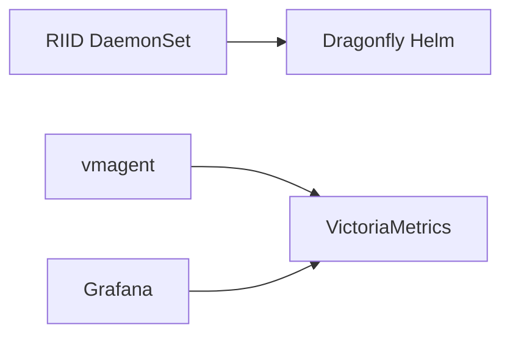

## deploy/k8s

Kubernetes manifests for **RIID** + **Dragonfly** (same Helm values as CI: root `scripts/values.yaml`). One Dragonfly client only—in `dragonfly-system`; do not add dfdaemon in `riid-system`. Java-side notes: **internalDocs/moduledocs/**.

### Layout

`namespace.yaml` · `riid/` (DaemonSet, ConfigMap, Service, `.env` → Secret) · `dragonfly/install-dragonfly.sh` · `storage/local-path-storage.yaml` (optional default SC) · `monitoring/worker/` (vmagent) · `monitoring/observer/` (VictoriaMetrics, Grafana) · **`Selectel/Makefile`** — deploy commands below.

### Flow

RIID and the Helm Dragonfly client run on workers; node `riid.monitoring=true` hosts VM/Grafana and is excluded from RIID/dfdaemon; vmagent is cluster-wide.

### Deployment

**Kubeconfig:** `deploy/k8s/Selectel/serverConfig.yaml` by default; override with `CONFIG_FILE=…` on every `make -C deploy/k8s/Selectel …`.

**Full sequence (Selectel/OpenStack default SC path):**  
`make -C deploy/k8s/Selectel install-all` — invokes `storage-default`, `mark-monitoring-node-auto`, `install-dragonfly`, `install-riid`, `wait-riid-ready`, `install-metrics-collector`, `wait-metrics-collector`, `install-riid-runtimes`, `install-smoke-utils`.

**Granular (same order if not using `install-all`):**  
`storage-default` · `mark-monitoring-node-auto` (`MONITORING_NODE=<node>` optional) · `install-dragonfly` · `install-riid` · `wait-riid-ready` · `install-metrics-collector` · `wait-metrics-collector` · `install-riid-runtimes` · `install-smoke-utils`.

**Registry credentials:** put `deploy/k8s/riid/.env` (see `riid/.env.example`); `install-riid` runs `secret-config-riid` (Docker Hub profile) when the file exists. Switch registry in-cluster: `make -C deploy/k8s/Selectel registry-dockerhub` or `registry-selectel`; updates `secret-config-riid` flow uses `riid/registry/*.yaml` profiles.

**Smoke pull:** `make -C deploy/k8s/Selectel smoke-download` — `SMOKE_REPOSITORY` — имя как на Docker Hub (default `library/jobber`). Для Selectel зеркала: `make init-performance-registry-images`, затем `SMOKE_REGISTRY_TARGET=selectel` (`deploy/k8s/Selectel/registry/performance-registry-smoke-map.tsv`).

**Observer stack** (after labeling the monitoring node): not in Makefile—`kubectl apply -f deploy/k8s/monitoring/observer/victoria-metrics.yaml -f deploy/k8s/monitoring/observer/grafana.yaml`.

**Other clusters:** without Cinder, apply `storage/local-path-storage.yaml` instead of `storage-default`; keep using the same `make` targets from `Selectel/` where kubectl context applies.
